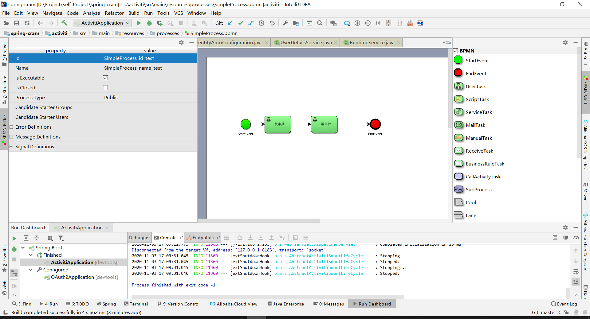
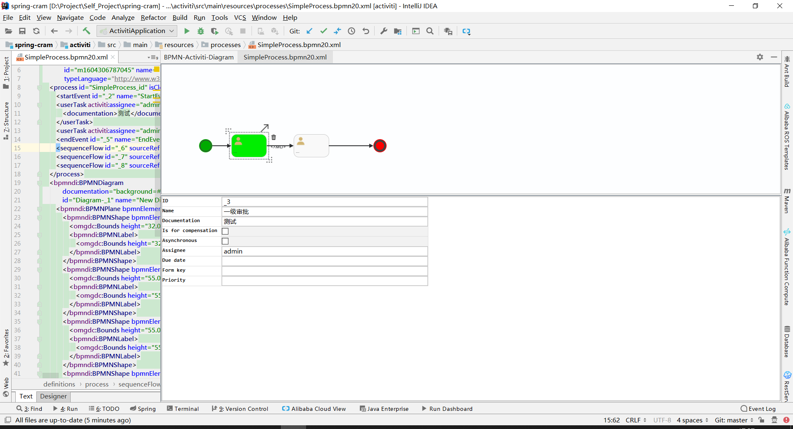

# [Activiti介绍](https://www.activiti.org/)
Activiti是一个轻量级的java开源[BPMN 2](https://zh.wikipedia.org/zh-hans/%E4%B8%9A%E5%8A%A1%E6%B5%81%E7%A8%8B%E6%A8%A1%E5%9E%8B%E5%92%8C%E6%A0%87%E8%AE%B0%E6%B3%95)工作流引擎.目前以升级至7.x,支持与springboot2集成.
# SpringBoot配置说明
* pom.xml 增加activiti-spring-boot-starter并指定对应版本.

``` xml
        <dependency>
            <groupId>org.activiti</groupId>
            <artifactId>activiti-spring-boot-starter</artifactId>
            <version>7.1.0.M6</version>
        </dependency>
        <!--        指定数据源-->
        <dependency>
            <groupId>org.springframework.boot</groupId>
            <artifactId>spring-boot-starter-jdbc</artifactId>
        </dependency>
```
* java配置
  activiti-spring-boot默认集成了spring security用于权限管理如需禁用security启动类中屏蔽ActivitiSpringIdentityAutoConfiguration,再增加一个配置类即可
  Application中禁用权限相关集成

``` java
package com.meijm.activiti;

import org.activiti.core.common.spring.identity.config.ActivitiSpringIdentityAutoConfiguration;
import org.springframework.boot.SpringApplication;
import org.springframework.boot.autoconfigure.SpringBootApplication;

@SpringBootApplication(exclude = {ActivitiSpringIdentityAutoConfiguration.class})
public class ActivitiApplication {
    public static void main(String[] args) {
        SpringApplication.run(ActivitiApplication.class);
    }
}

```
增加配置类ActivitiSpringIdentityAutoConfiguration,其中有三个方法在源码中并未查询到引用暂时不处理
``` java
package com.meijm.activiti.config;

import com.google.common.collect.ImmutableList;
import org.activiti.api.runtime.shared.identity.UserGroupManager;
import org.springframework.context.annotation.Bean;
import org.springframework.context.annotation.Configuration;

import java.util.List;

@Configuration
public class ActivitiSpringIdentityAutoConfiguration {
    @Bean
    public UserGroupManager userGroupManager() {
        return new UserGroupManager() {
            @Override
            public List<String> getUserGroups(String s) {
                return ImmutableList.of("指定用户归属组");
            }

            @Override
            public List<String> getUserRoles(String s) {
                return null;
            }

            @Override
            public List<String> getGroups() {
                return null;
            }

            @Override
            public List<String> getUsers() {
                return null;
            }
        };
    }
}

```
完成以上配置后项目启动时会创建基础的数据表,不包含历史记录等,如需要则在配置文件中增加配置即可.[配置介绍](https://www.cnblogs.com/liaojie970/p/8857710.html).
启动后可能会不创建数据表,数据库连接中增加nullCatalogMeansCurrent=true这个参数就好了,具体原因不明

```
spring.datasource.url=jdbc:p6spy:mysql://localhost:3306/m-activiti?serverTimezone=UTC&nullCatalogMeansCurrent=true
```
工程启动后会自动加载/resources/processes下流程图配置文件, 支持两种格式*.bpmn20.xml,*.bpmn

# 流程图编辑IDEA插件
**actiBPM:**安装后对*.bpmn后缀的文件可以直接打开流程图编辑视图,效果如下,编辑保存后会在标签中增加xmlns=""属性,会导致自动部署失败,可以手动删除此属性,也可以通过spring.activiti.check-process-definitions=false来关闭流程文件检查.



**Activiti BPMN visualizer** 安装后打开*.bpmn20.xml文件,右键选择"View BPMN(Activiti) Diagram"可打开流程图编辑页,效果如下图




# API说明
集成配置好之后会在系统注入以下bean,使用时增加注入即可,最常用的是前三个bean.
|名称|介绍|
|-|-|
|RuntimeService |执行时Service可以处理所有执行状态的流程例项流程控制(开始,暂停,挂起等)|
|TaskService |任务Service用于管理、查询任务，例如签收、办理、指派等|
|RepositoryService|流程仓库Service,可以管理流程仓库例如部署删除读取流程资源|
|IdentitiServicec |身份Service可以管理查询使用者、组之间的关系|
|FormService |表单Service用于读取和流程、任务相关的表单资料|
|HistoryService |历史Service用于查询所有的历史资料|
|ManagementService |引擎管理Service，和具体业务无关，主要查询引擎配置，资料库作业|
|DynamicBpmService |动态bpm服务|

# 例子
下面源码中包含一个简单的流程例子,包含两个用户任务,提供了controller来操作流程
/baseActiviti/start:流程启动
/baseActiviti/taskList:查看指定用户的任务
/baseActiviti/completeTask:完成指定任务


**说明:**

1. 流程图配置中assignee表示指定的用户
2. 由于实体中包含一些运行时内容不便于序列化所以返回时去掉了一些属性

地址:https://gitee.com/MeiJM/spring-cram/tree/master/activiti


# 参考资料
https://www.activiti.org/userguide/#springSpringBoot

https://blog.csdn.net/yang_zzu/article/details/103998671

https://www.cnblogs.com/tianguodk/p/9414363.html

https://blog.csdn.net/qq_40887780/article/details/83588130

https://www.cnblogs.com/liaojie970/p/8857710.html


