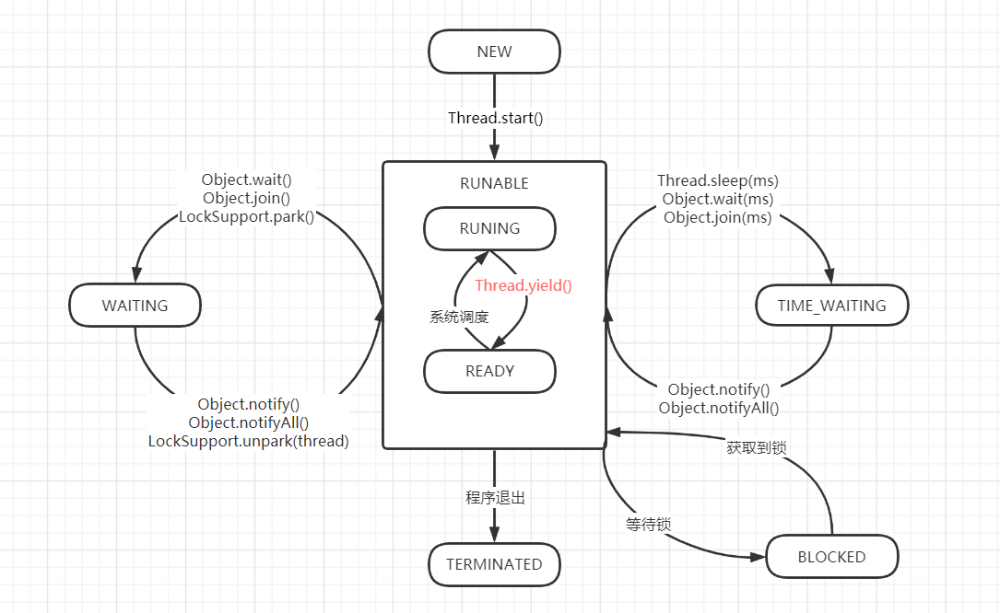
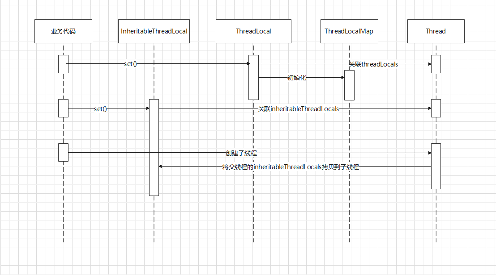
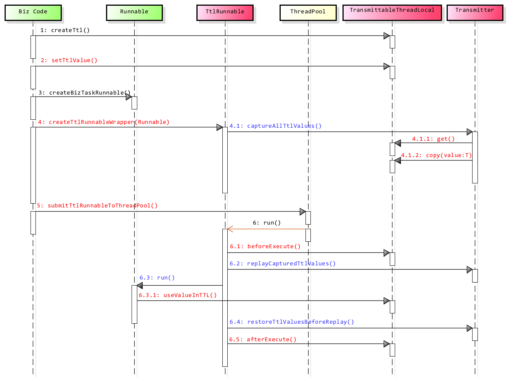
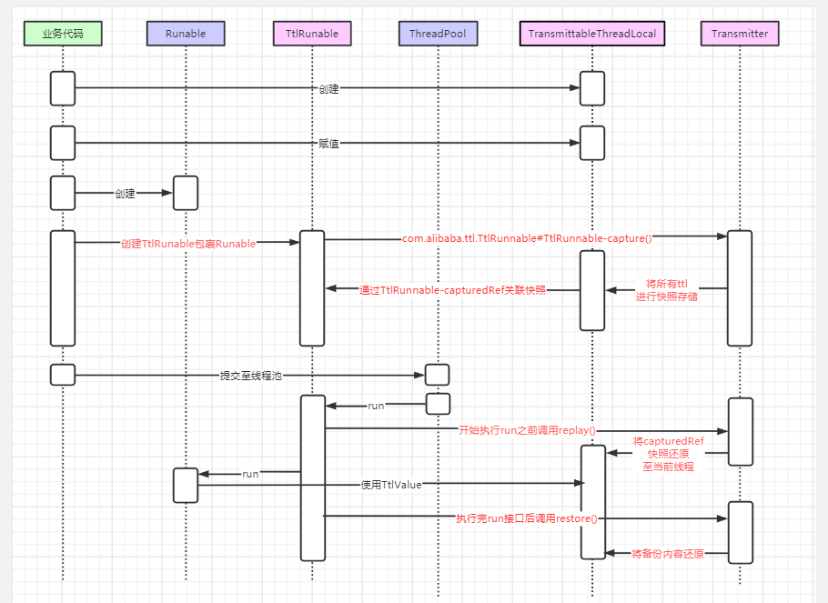

# Thread

## 生命周期

## 相关方法

interrupt()：实例方法将线程中断标识设置为true,如线程在wait/sleep则报java.lang.InterruptedException

interrupted():静态方法,Thread.interrupted()重置当前线程中断标识

isInterrupted(): 实例方法获取当前线程中断标识

join()：中断当前线程，等待调用线程结束后再执行

Thread.sleep(millis):当前线程休眠x毫秒，不释放持有锁

LockSupport.park():中断当前线程,不释放持有锁

Object.wait(millis):当前线程等待x秒,不传递则无限期等待,释放持有锁

## 线程变量

ThreadLocal:同线程内共享，无法传递至子线程

生命周期：在设置第一个值时通过Thread.currentThread()与当前线程中threadLocals进行关联，并初始化一个ThreadLocalMap进行存储。

ThreadLocalMap中存储内容的Entry使用的是WeakReference弱引用，便于垃圾回收。

* 在非线程池情况下由于key为弱引用在代码中没有继续使用时(强引用去掉后只剩弱引用),会被gc回收.get方法会清理不存在的key对应的value，保障了内存回收
* 在线程池中使用时由于线程不会被回收，Thread这个强引用不会被清理,所以存在内存溢出风险。 可在使用完成之后通过remove方法清理来规避这个隐患。
* 使用static初始化时也存在生命周期过长存在内存溢出隐患

InheritableThreadLocal:只有在创建线程池时会初始化,所以线程池场景会导致赋值逻辑混乱

重写了childValue(),getMap(Thread),createMap(Thread t, T firstValue) 来实现子线程的内容赋值

ThreadLocal/InheritableThreadLocal 使用流程:

TransmittableThreadLocal:可传递至子线程,子线程独立操作,新开线程也会获取新的值,需配合TtlRunnable或修改java启动参数来使用

整个过程的完整时序图:

依据官方时序图自己的整理:

