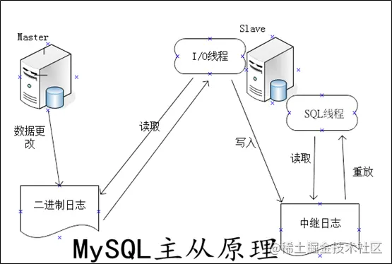
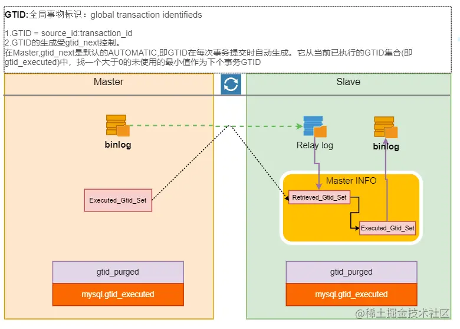

# 原理

## 基于binlog



## 基于binlog+gtid


在原有流程上增加了gtid的记录.

通过gtid mysql不必再指定binlog文件名及binlog_pos.

# 配置文件

配置文件位置/etc/my.cnf或/etc/mysql/my.cnf

## 配置文件内容
``` prop
[mysqld]
# 标识机器id，在binlog中会记录此信息，在slave机器中也回记录对应的master主机server_id
server_id=1

# 主库配置
# binlog名称,表示开启binlog
log-bin=mysql-bin

# binlog记录的记录类型 可选ROW/STATEMENT/MIXED
binlog-format=STATEMENT

# 当binlog-format为ROW/MIXED可以设置binlog_row_image
#可选参数full|minimal|noblob 默认为full
binlog_row_image=full

#binlog记录过滤相关参数
# binlog忽略的库，可配置多个
binlog-ignore-db=mysql
binlog-ignore-db=sys
binlog-ignore-db=information_schema

# binlog记录的库
binlog-do-db=mycattest


#从库配置
#启用中继日志，中继日志名称
relay-log=mysql-relay

#将中继日志记录加入到binlog中,默认不会加入,多主多从时使用 
log-slave-updates=on

#在主服务器宕机或连接丢失的情况下，从服务器线程重新尝试连接主服务器之前睡眠的秒数。默认60s
master-connect-retry=60

#复制过滤相关参数
#需要复制的库
replicate-do-db=keyboard

#不需要复制的库
replicate-ignore-db=mysql

#需要复制的表支持通配符%_如需用到_需要转义
replicate-wild-do-table=库名.表明+通配符
replicate-wild-do-table=表明+通配符

#需要忽略复制的表支持通配符%_如需用到_需要转义
replicate-wild-ignore-table=name

# 多主环境使用,步长一致的情况下起始值不一样多个库之间自增id不会冲突
#表示自增长字段每次递增的量，指自增字段的起始值，其默认值是1，取值范围是1 .. 65535
auto-increment-increment=2 
# 表示自增长字段从哪个数开始，指字段一次递增多少，他的取值范围是1 .. 65535
auto-increment-offset=1

# GTID:
# 开启GTID
gtid_mode=on
# 开启GTID一致性校验,无法使用临时表,无法使用CREATE TABLE ... SELECT statements语句,无法使用非事务引擎
enforce_gtid_consistency = on
```
> 查询环境变量语句：show variables like '%relay%';

## [binlog-format参数说明](https://i4t.com/213.html)
|值|说明|优点|缺点|
| --- | --- | --- | --- | --- |
|ROW|从数据层面记录变化|确保数据一致性|记录日志过多，且效率底例如批量更新会记录所有更新后的数据|
|STATEMENT|记录修改的SQL|节省空间，性能高|无法正确解析依赖上下文的环境变量，及数据库函数,例如@@hostname,UUID()等|
|MIXED|依据每条sql判断使用哪种模式记录日志|综合了两个模式优点尽量保证了数据一致性|增加了复杂性|


**企业场景如何选择binlog模式**
1、互联网公司，使用MySQL的功能相对少（存储过程、触发器、函数）
选择默认的语句模式，Statement Level（默认）
2、公司如果用到使用MySQL的特殊功能（存储过程、触发器、函数）
则选择Mixed模式
3、公司如果用到使用MySQL的特殊功能（存储过程、触发器、函数）又希望数据最大化一直，此时最好选择Row level模式


**Mixed切换为ROW模式记录场景**

* 当 DML 语句更新一个 NDB 表时；
* 当函数中包含 UUID() 时；
* 2 个及以上包含 AUTO_INCREMENT 字段的表被更新时；
* 执行 INSERT DELAYED 语句时；
* 用 UDF 时；
* 视图中必须要求运用 row 时，例如建立视图时使用了 UUID() 函数；
* 事物隔离级别较高时默认事物隔离级别为REPEATABLE-READ


## [binlog_row_image参数说明](https://i4t.com/213.html)
|值|说明|
| --- | --- |
|full|记录所有列变化|
|minimal|记录需要修改的列|
|noblob|在没有对text、blob列进行修改时不会记录text、blob列|


# 主从同步相关命令

``` sql
#主库执行,增加用于同步的账号
GRANT REPLICATION SLAVE ON *.* TO 'slave'@'%' IDENTIFIED BY '123123';
flush privileges;
```


## 基于Position进行主从复制

``` sql
#主库执行,查询master的状态,记录File,Position列中值
show master status;

#从库执行,MASTER_USER对应上面创建的同步用户,
CHANGE MASTER TO MASTER_HOST='主机的IP地址',
MASTER_USER='slave',
MASTER_PASSWORD='123123',
MASTER_LOG_FILE='File值',MASTER_LOG_POS=Position值;

# 从库执行,启动复制功能
start slave;

# 从库执行,查看从服务器状态(在工具中可删掉/G),检查Slave_IO_Running/Slave_SQL_Running是否为yes
show slave status/G;

# 从库执行,停止复制功能
stop slave;

# 从库执行,重置主库相关配置
reset master;

```


## 基于GTID进行主从复制

``` sql
# 从库执行,设置master语句不同,其它相同
CHANGE MASTER TO MASTER_HOST='主机的IP地址',
MASTER_USER='slave',
MASTER_PASSWORD='123123',
MASTER_AUTO_POSITION=1;
```


# 错误数据修复方法

**全量还原并重置同步:**停止从库复制功能更,从库全量还原主库,并重新设置master(当数据差异很大时使用)

## 基于普通binlog修复
常见错误Error_code: 1032; handler error HA_ERR_KEY_NOT_FOUND

``` sql
# 查看当前从库状态,关注Exec_Master_Log_Pos表示执行到了binlog哪个位置,Last_Error表示执行该语句出错原因
show slave status;

# 查看主库对应位置执行内容,$Exec_Master_Log_Pos对应上面查出来的值,
# 查看binlog 语法: show binlog events [in 'binlog文件名'][from 具体位置];
show binlog events from $Exec_Master_Log_Pos;

# 使用工具解析binlog
# 需要查看binlog具体位置,以及mysqlbinlog安装位置
#  mysqlbinlog --start-position 792971240 --stop-position 792972566 /var/lib/mysql/mysql-bin.000004 -r temp.sql
#  mysqlbinlog --base64-output=auto -vv /var/lib/mysql/mysql-bin.000004 --start-position 792971240 --stop-position 792972566 > decode.log


stop slave;
#跳过N个事务,通常为1即可
SET GLOBAL SQL_SLAVE_SKIP_COUNTER = N;
start slave;

# 检查Slave_IO_Running,Slave_SQL_Running是否都为Yes,
show slave status;
```


## 基于GTID修复

``` sql
# 查看当前从库状态,关注Exec_Master_Log_Pos表示执行到了binlog哪个位置,Last_Error表示执行该语句出错原因
show slave status;

# 查看主库对应位置执行内容,$Exec_Master_Log_Pos对应上面查出来的值,
# 查看binlog 语法: show binlog events [in 'binlog文件名'][from 具体位置];
show binlog events from $Exec_Master_Log_Pos;

mysql-bin.000001    7103    Gtid    1    7182    SET @@SESSION.GTID_NEXT= '9fdb6bdf-8239-11eb-8593-0242ac110003:23'
mysql-bin.000001    7182    Query    1    7270    BEGIN
mysql-bin.000001    7270    Query    1    7417    use `mjmtest`; INSERT INTO `mjmtest`.`test`(`id`, `name`) VALUES (8, 'asdfasd')
mysql-bin.000001    7417    Xid    1    7448    COMMIT /* xid=154248 */
mysql-bin.000001    7448    Gtid    1    7527    SET @@SESSION.GTID_NEXT= '9fdb6bdf-8239-11eb-8593-0242ac110003:24'
mysql-bin.000001    7527    Query    1    7615    BEGIN

# 从库跳过该event对应的gtid
stop slave;
# 此处gtid来源于binlog event查询结果
set GTID_NEXT = '9fdb6bdf-8239-11eb-8593-0242ac110003:23';
begin;
commit;
SET GTID_NEXT="AUTOMATIC";
start slave;

# 检查Slave_IO_Running,Slave_SQL_Running是否都为Yes,
show slave status;
```


# 参考资料

https://i4t.com/213.html

https://www.cnblogs.com/zhoujinyi/p/5436250.html

https://dev.mysql.com/doc/refman/5.7/en/replication-options-replica.html#replication-sysvars-slaves

https://zhuanlan.zhihu.com/p/46779877

https://blog.csdn.net/Enmotech/article/details/107479240

